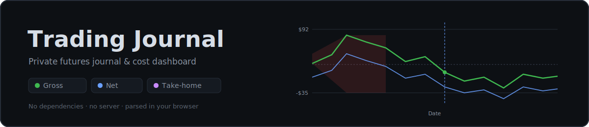

<p align="center">
  
</p>

<p align="center">
  
  
  
  
  
</p>

---

**Blotterbook** is a **dependency-free** trading journal and cost dashboard for futures traders. It
reads a balance-history CSV exported from **TradingView**, parses it entirely in the browser, stores
it **locally** (IndexedDB), and renders performance, calendar, cost, filter, and statistics views.
All computation is client-side and **no trade data ever leaves the browser**. The only network
call is loading the app's own reference-data JSON.

> **Design pillars (intentional constraints):** compute happens locally, there are **no runtime
> dependencies**, and the whole thing deploys as static files to **Cloudflare Pages**. The app
> *is* split across files (it used to be one `index.html`), so it must be **served over http(s)** —
> opening it from disk will block the `fetch()` of the reference data.

## Table of contents

- [Project layout](#project-layout)
- [Marketing homepage](#marketing-homepage) — the one-page site at `/`
- [Quick start](#quick-start)
- [Input: the CSV](#input-the-csv) — and how re-uploads merge
- [Platform adapters & auto-detection](#platform-adapters--auto-detection) — multi-platform CSV import
- [UI walkthrough](#ui-walkthrough)
- [Cost model](#cost-model) — commissions, subscriptions, tax
- [Reference data (JSON)](#reference-data-json) — brokers, fees, feeds, states + cache-busting
- [Local persistence](#local-persistence) — IndexedDB, delta merge, purge
- [Managing local data](#managing-local-data) — edit, back up, and restore
- [Filters & journal](#filters--journal)
- [Architecture](#architecture)
- [Pricing & tiers (scaffold)](#pricing--tiers-scaffold)
- [Roadmap](#roadmap)
- [Known limitations](#known-limitations)
- [Privacy](#privacy)
- [Development & deployment](#development--deployment)
- [License](#license)

## Project layout

```
/                       marketing + info site (own CSS in index.html; site.css for the rest)
  _headers              Cloudflare Pages security headers (CSP + hardening) for every response
  tokens.css            design tokens (colors + fonts) — single source, used by every surface
  index.html            homepage: hero + features + use cases + platforms + pricing + FAQ
  howto.html            "How To" wiki: getting-started walkthrough + per-platform import guides
  roadmap.html          shipped vs. planned checklist (styled like the changelog)
  changelog.html        "Blotterlog" — versioned release notes (reads curated data/changelog.json)
  legal.html            disclaimers, terms of use, privacy summary
  admin.html            internal admin controls (Cloudflare Access–gated; sets the Live indicator)
  site.css              shared styles for howto / roadmap / changelog / legal / admin (@imports tokens.css)
/partials/              shared HTML fragments injected at build time (single source)
  nav.html              the info-site nav (changelog / roadmap / legal / howto)
  footer.html           the info-site footer
/app/                   the journal app
  app.html              app markup (links app.css + the app scripts below); served at /app/ via a _redirects rewrite
  demo.html             the demo on its own page (shares app.css + the app scripts; opens in a new tab)
  staging.html          1:1 sandbox clone of the main app (body[data-mode=staging]; key-gated) for trialling changes
  app.css               all app styles (shared by app.html / demo.html / staging.html)
  core.js               globals, DOM helpers, metrics, formatting, cost model, reference-data loading
  render.js             dashboard rendering (cards, curve, calendar, advanced, break-even) + scope/filter driver
  data.js               CSV import, demo data, filters, day-notes journal, session restore, setup controls
  ui.js                 collapsible/drag panels + file-download / setup-label helpers
  export.js             condensed performance report (print → PDF)
  datamanager.js        Manage-data modal + per-trade editor + backup/restore
  staging.js            staging-ONLY flair (activity terminal, session pill, workspace templates) — loaded only by staging.html
  main.js               DOM event wiring + boot() — loaded LAST (core→render→data→ui→export→datamanager→[staging]→main)
  adapters.js           platform CSV adapters + format auto-detection + fills matcher
  store.js              IndexedDB persistence (trades, journal, meta, per-trade trademeta)
  entitlements.js       storage-tier resolver (scaffold; always "local" today)
/data/                  reference data, fetched at runtime
  brokers.json          broker commission tiers
  exchange-fees.json    CME exchange/clearing/NFA fees + micro set
  feeds.json            per-broker market-data feed options
  state-tax.json        Section 1256 model + per-state top rates
  manifest.json         content hashes for cache-busting (generated)
  backlog.json          engineering backlog — committed source of truth (rendered read-only in admin.html)
  changelog.json        curated, version-keyed release notes for changelog.html (prod track)
/functions/             Cloudflare Pages Functions
  _middleware.js        key-gates /app/staging.html (x-admin-key header / bb_staging cookie / ?k=)
  api/geo.js            visitor region (Cloudflare edge geo) → pre-fill the tax state
  api/status.js         homepage Live-indicator status (GET public; POST admin-only, KV-backed)
  api/config.js         feature flags + reference-data cache version + platform versions (KV; POST admin-only)
  api/admin-key.js      returns ADMIN_KEY to Access-authenticated admins (key auto-fill)
  api/{me,checkout,webhook}.js   Stripe/accounts scaffold
  README.md             accounts/payments/storage-tier plan
/scripts/
  build-includes.mjs    injects partials/nav.html + footer.html into the info pages (node scripts/build-includes.mjs)
  build-manifest.mjs    regenerates data/manifest.json (Node built-ins only)
  test-adapters.cjs     synthetic tests for the platform adapters (node scripts/test-adapters.cjs)
/assets/banner.svg
/assets/favicon.svg     site favicon (the gradient square from the wordmark)
LICENSE                 proprietary — all rights reserved
```

## Marketing &amp; info site

The site root (`index.html`) is a **single-page, scrollable marketing site** for Blotterbook,
styled with the same dark palette and tokens as the app. A minimalist sticky header carries
anchor links plus links to the standalone info pages:

| Section | Purpose |
| --- | --- |
| **Home** | The hero (banner, tagline) with **Launch Blotterbook** and **See Demo** CTAs, plus a **Live** status pill — it honors an admin override from `/api/status` and otherwise pings `/app/`. |
| **Features** | A three-column grid of the app's capabilities (privacy, cost model, tax, broker comparison, curve/calendar, stats). |
| **Use Cases** | The pitch — Blotterbook as both a profit/budgeting calculator and a private journal. |
| **Platforms** | A grid of supported import platforms, each badged **Verified · real data** (TradingView) or **Beta · synthetic** (the rest), linking to the How-To guides. |
| **Pricing** | Two cards: **Blotterbook — Free** and a greyed-out, planned **Online app (~$49/mo)**. The current CSV-driven app stays free. |
| **FAQ** | Expandable questions covering supported data, cost/tax modeling, and limitations. |

**Standalone info pages** (share `site.css`):

- **`howto.html`** — a How-To wiki with a sticky sidebar: a getting-started walkthrough (with
  non-interactive mockups of the app's modules) and a per-platform import guide for each supported
  export, each marked verified vs. synthetic-tested.
- **`roadmap.html`** — a shipped-vs-planned checklist (shipped items crossed off; planned items
  flagged with priority), styled like the changelog.
- **`changelog.html`** ("**Blotterlog**") — versioned, user-facing release notes (see
  [below](#changelog-release-notes)). Reads the curated **`data/changelog.json`**, not raw commits.
- **`legal.html`** — disclaimers (not a broker, estimates only), terms of use, and a privacy summary,
  linked from every footer alongside a one-line disclaimer.

### Changelog release notes

`changelog.html` → `assets/changelog.js` renders **`data/changelog.json`** (F13): a curated,
version-keyed release-notes file for the **prod** (main + demo) track, newest first. Each entry has a
prod `version` (the CH12 two-track version — `chore(release)` commits mark version boundaries on
`main`), a `date`, a friendly `title`/`summary`, and optional `highlights`. Everything before
automated versioning is rolled up into a single `beta: true` "Beta released" entry.

It is **manually curated** — add a new entry at the top of `releases` each time the prod version
bumps. This deliberately replaces the old raw-commit feed (the retired `/api/changelog` Function) so
the page reads as release notes, not a git log. The file is hash-cache-busted by `build-manifest`
like other `data/*.json`; `assets/changelog.js` keeps a tiny inline fallback for local dev / a failed
fetch.

### Location-based tax state

`functions/api/geo.js` returns the visitor's coarse region from Cloudflare's edge metadata
(`request.cf`), and the app calls `/api/geo` on the landing screen to **pre-select the US state** for
the tax estimate. No IP or third-party service, nothing stored; it never overrides a chosen/saved
state and silently does nothing off-Cloudflare or outside the US.

### Admin page &amp; the Live indicator

`admin.html` is an internal control page. It can set the homepage's **Live** pill, manage **feature
flags** + a **reference-data cache version**, record the **platform versions** per surface, show a
read-only **Backlog** view (per-category completed/remaining counts + the item list from
[`data/backlog.json`](data/backlog.json) — titles/effort/status only, prompts stay in the file), auto-fill
its own admin key, and **launch the staging sandbox** (carrying the key for you). The homepage pill
reads `/api/status`: a fixed status (**Live** = green, **Maintenance** = yellow, **Offline** = red,
with an optional label) wins; otherwise (**Auto**) it pings `/app/`. `GET /api/status` and
`GET /api/config` are public; all writes are admin-only.

**Backend setup:** bind a **KV namespace** as `STATUS_KV` to the Pages project (stores status +
config), and set an **`ADMIN_KEY`** secret (`POST /api/status` and `/api/config` require a matching
`x-admin-key` header). Detailed click-paths are in [`functions/README.md`](functions/README.md).

**Admin key auto-fill.** `/api/admin-key` returns `ADMIN_KEY` only to requests that carry Cloudflare
Access's `Cf-Access-Jwt-Assertion` header (i.e. an authenticated admin); the admin page fetches it on
load and pre-fills the key, so you never type it. Off-Access it 401s and you enter the key manually.

**Protecting the admin panel.** The admin panel is protected by **Cloudflare Access** plus the
**`ADMIN_KEY`** on writes — `functions/_middleware.js` no longer 404s `/admin` (an earlier version did,
which blocked admin access; that was reverted). To lock it to its own subdomain:

1. **Add the subdomain to the Pages project.** Pages → *Custom domains* → add `admin.blotterbook.com`.
2. **Point the subdomain root at `admin.html`.** A custom domain serves the whole site, so add a
   **Redirect Rule** (Rules → *Redirect Rules*): *When* `hostname equals admin.blotterbook.com` *and*
   `URI path equals /` → redirect to `https://admin.blotterbook.com/admin.html` (or a Transform rewrite).
3. **Cloudflare Zero Trust (Access).** Zero Trust → *Access* → *Applications* → **Self-hosted** →
   domain `admin.blotterbook.com`; policy *Allow* your email/IdP. Add the apex path too if you want to
   block `blotterbook.com/admin`.
4. **`ADMIN_KEY` stays as a second layer** — writes are defended by both Access *and* the key.

**Staging is key-gated.** `functions/_middleware.js` now gates `/app/staging.html`: it requires the
`ADMIN_KEY` via an `x-admin-key` header, a `bb_staging` cookie, or a `?k=` query param (if `ADMIN_KEY`
isn't configured, staging stays open). Browsers can't set request headers on a navigation, so the admin
panel's **Launch staging env** button sets the short-lived `bb_staging` cookie (the navigation-safe
equivalent — the Cookie request header) before opening the page.

The admin page degrades gracefully off Cloudflare (locally the APIs 404 and it shows "deploy on
Cloudflare to use").

### Versioning &amp; releases (automated — CH12)

Versioning is **automated from commits + PR merges**; there's nothing to bump by hand. Two tracks live
in one source of truth, `data/versions.json`:

- **`prod`** — shared by the main app and demo (their header badges both show it).
- **`staging`** — the staging sandbox's own, faster-moving version.

The platform **phase** is *derived*, not stored: while the prod major is `0` the label reads
**Beta `<prod>`** (e.g. `Beta 0.12.0`); at `1.0.0`+ the "Beta" drops.

**How a bump happens.** On every push to `main`, the `Version bump` workflow
(`.github/workflows/version-bump.yml` → `scripts/bump-version.mjs`) reads the merge commit:

1. **Level** from the conventional-commit type in the squash-merge title — `feat:` → minor, `fix:`/
   `chore:`/`refactor:`/etc → patch, `feat!:` or a `BREAKING CHANGE:` footer → major, untyped → patch.
   (See the `commitConvention` field in `data/backlog.json`.)
2. **Which track** from the changed paths — any **prod-shipping** file (shared `app/*.js` except
   `staging.js`, `app/app.html`/`demo.html`/`app.css`, `partials/*`, `assets/*`, `tokens.css`, `data/*`
   except versions/backlog json) bumps **both** prod and staging; **only** `app/staging.{js,html}` bumps
   staging alone; non-app changes (info pages, README, `.github`) bump nothing.

It writes `data/versions.json` and commits it back to `main` as `chore(release): … [skip ci]` (so it
doesn't re-trigger itself). **Requires** the GitHub Actions bot to be allowed to push to `main`; if the
branch is protected the job logs a warning instead of failing — grant the bot push access (or run
`scripts/bump-version.mjs` in a release PR) to enable it.

**Display is runtime-fetched.** Each page's `.ver` badge is populated at load from
`/data/versions.json` (`assets/util.js`), with the baked literal in `partials/app-topbar.html` as the
offline fallback. `/api/config` and the admin panel surface the same values **read-only** (the old
manual entry + KV `versions` record are retired); `app/staging.js`'s "session ready" line reads the
badge after it's populated.

Separate, unrelated version numbers are intentionally **not** touched by this: `store.js` `DB_VERSION`
(IndexedDB schema), the backup-file `version`, `manifest.json` content hashes, and the admin
`refDataVersion` cache stamp.

### Staging sandbox

`app/staging.html` (`body[data-mode="staging"]`) is now a **clone of the main app**, not the demo —
launched from the admin page (**Launch staging env**) to trial changes before they reach the main app.
It uses an **isolated IndexedDB** (`blotterbookStaging`, set in `store.js`) so testing never touches
real data, and **seeds the sample dataset once** so it opens in the loaded state (Erase all local data
→ the initial state, matching the main app). It has the full top bar including **Manage data** and the
**Load CSV** landing; notes/tags/filters persist to its own DB.

Staging-only experiments (gated by `STAGING_PAGE` — the main app is unchanged):

- **Web-grid dashboard** — fills the window (edge-to-edge, `max-width:none`) at ≥1100px with a grid
  placed by DOM order so **drag-to-reorder** keeps working; the performance graph spans full width,
  the rest flow into 2–3 columns, and the stats panel stacks for readability.
- **Filters affect the graph only** — the calendar, cards, cost, and stats always use the full dataset;
  filters (incl. a date range) re-draw the **performance graph** alone.
- **Sharper graph** — the curve renders at its real pixel width so labels aren't horizontally stretched.
- **Note dots on the graph** — a small blue dot marks each date that has a day-note (like the calendar).
- **Saved filters** — name and recall filter views from the filter bar (**Save filter** + a Saved
  dropdown), managed in **Manage data → Saved filters**; stored in the staging DB's meta.
- **Note dots on no-trade days** — a day-note on a date with no trades now lands on the equity line
  (interpolated/carried forward), not dropped to the baseline.
- **Activity terminal** — a read-only, bottom-of-grid console that live-logs platform actions (CSV
  imports, note saves, backups, deletes, connectivity changes). Display only; takes no input.
- **Session-status pill** — a header indicator (green online / yellow offline / red degraded) that
  follows connectivity; clicking it opens a legend. Forward-looking flair — no module needs a
  connection yet.
- **Workspace templates** — **Save layout** / load / **Default** controls in the header that capture
  which modules are placed where and which are collapsed; stored in `localStorage` (`tj_ws_templates`).
- **Equal-size modules** — calendar, break-even, and advanced-stats panels share row height (the grid
  stretches them) so they no longer leave negative space.

The **demo** also gains a preview-only **Manage data** panel: it renders the in-memory sample
(overview + read-only trade list) with every action disabled and a "preview only" banner, so visitors
can see the feature without touching the example data.

### Mobile navigation

On narrow screens the header's nav links collapse behind a **hamburger menu** that replaces the
Launch button; tapping it drops down the full nav (including a Launch link). Implemented with a
CSS-only checkbox toggle on every page (homepage + the shared `site.css` pages).

## Quick start

1. Serve the folder over http (see [Development](#development--deployment)) and open `/app/`
   (in production a `_redirects` rewrite maps `/app/` → `/app/app.html`; opening `/app/app.html`
   directly works everywhere, including the local static preview). The homepage at `/` links to it
   (**Launch Blotterbook**).
2. In the centered **Broker & Costs** panel, choose your **Broker**, **Data feed**, and **State**,
   and set the monthly **Platform fee**. (Load CSV is disabled until all three are chosen.)
3. In TradingView, export your account balance history as CSV.
4. Click **Load CSV** and select the file. Your data is saved locally — it's restored
   automatically next time you open the app. Load more CSVs later from **Manage data → Load CSV**.

Prefer to look around first? Open **See Demo** on the homepage for a generated, profitable two-year
sample dataset (not saved). To erase your data, use **Manage data → Erase all local data**.

## Input: the CSV

Blotterbook reads CSV exports from a trading **platform** and **auto-detects** the format — see
[Platform adapters](#platform-adapters--auto-detection). The flow is two-step so a bad file never
silently corrupts your data:

1. **Load CSV** → the file is parsed and the platform is detected (you can override it from the
   **Platform** dropdown). A status line confirms what was found (e.g. *Detected TradingView · 63
   trades ready*) or explains the problem.
2. **Start Blotterbook** (landing) or **Import** (Manage data) commits the parsed trades.

Only `.csv` files are accepted, and nothing loads until a parse succeeds.

The reference format is the **TradingView** "List of trades" export — required columns (matched
case-insensitively by substring): **`Time`**, **`Realized PnL (value)`** (falls back to
`Realized PnL`), and **`Action`**. Each row is one trade — a position-*close* event with its own
realized PnL; the instrument comes from the `Action` text and reduces to a **root ticker**
(`MESM2025` → `MES`, `MES1!` → `MES`, `M2KZ2025` → `M2K`).

```
Time,Action,Realized PnL (value)
2026-06-02 10:00:00,"Close long position for symbol MESM2025 at price 5300.00",75.00
```

**Re-uploads merge.** Each trade gets a stable id from its `time + symbol + side + pnl`. Uploading
a CSV that overlaps a previous one only inserts the genuinely new rows, so you can export a wider
window each time without creating duplicates. The data summary shows `+N new · M dup`.

## Platform adapters & auto-detection

Parsing is keyed to the trading **platform** the CSV came from (TradingView, Tradovate, …) — **not**
the broker. The two are independent: you might clear through **AMP** but export from **TradingView**.
The Broker dropdown only drives the cost model; the Platform dropdown (and the detector) drives
parsing. `app/adapters.js` is a small registry — `window.Adapters` — with:

- **`detect(text)`** — sniffs the header row against each adapter's signature columns and returns the
  best match (e.g. Tradovate has `B/S` + `Contract`; Rithmic has `Buy/Sell` + `Qty Filled`; IBKR has
  `DateTime` + `Buy/Sell` + `Proceeds`). No match → the user picks the platform manually.
- **`parse(text, platformId?)`** — runs the chosen (or detected) adapter and returns
  `{ ok, trades, platform, label, beta, … }` or `{ ok:false, error }`.

Every adapter **normalizes to the same internal trade shape** — `{ time, date, pnl, symbol, root,
side[, qty, entryTime, exitTime, holdMs] }` — so `compute()` / `costModel()` never change. Two export
styles are handled:

- **Closed positions** — each row is a finished trade with realized PnL (**TradingView**,
  **MotiveWave**).
- **Fills** — individual buy/sell executions. A FIFO **round-trip matcher** (`pairFills()`) pairs
  entries→exits per symbol to build closed trades — and that finally unlocks **hold time** (shown as
  *Avg Hold Time* in Advanced Statistics when available). When a fills export carries realized PnL per
  closing row (IBKR), it's used directly; otherwise PnL is computed from price × a built-in futures
  **point-value** map (unknown roots default to ×1, correct for equities).

Supported platforms: **TradingView** (verified), plus **Tradovate, Rithmic R\|Trader, Sierra Chart,
TradeStation, MotiveWave, Webull, Interactive Brokers, Schwab/thinkorswim** — these are `beta`,
built from documented formats and exercised by `scripts/test-adapters.cjs` with synthetic samples.
They're flagged *(beta — verify the numbers)* in the UI until validated against a real export.
**Adding a platform** = one object in `adapters.js` (`sniff` + `toTrades`) and a fixture in the test.

## UI walkthrough

| Section | What it shows |
| --- | --- |
| **Top bar** | The **Blotterbook** wordmark (links to the homepage) and the loaded-source text — once data is loaded, clicking it opens **Manage data** (it does nothing before load); it's truncated so long filenames don't bloat the bar. Actions: **Changelog**, **Export report**, **Manage data**, Contact. |
| **Landing (no data)** | The intro and the **Broker & Costs** module sit centered as a group (like the homepage hero). **Load CSV** is always available — pick a file and a **Platform** dropdown (auto-filled by the detector) plus a parse-status line appear. **Start Blotterbook** commits and enters the app; it stays disabled until a CSV parses *and* broker/feed/state are chosen (the gate moved off Load CSV onto Start). |
| **Broker & Costs** | Broker (incl. **TradingView PaperTrade**) / data feed / platform fee / state. Drives the cost model only — independent of the CSV's platform. **Starts minimized** once data is loaded (the load/Start controls are hidden); selections persist. |
| **Scope toggle** | Switches most views between *All time* and the *Selected month*. |
| **Filters** | Date range, symbol, side, session (RTH/ETH), **tag** (when any per-trade tags exist), and day-of-week. Applies before everything. |
| **Stat cards** | Net PnL (+ take-home), win rate, profit factor, avg win/loss, max drawdown. |
| **Performance** | Cumulative PnL vs. date, with stepped y-axis gridlines and a gradient area fill. Click the **Gross / Net / Take-home** buttons to toggle overlays (at least one stays on); hover for values; **click anywhere on the graph to select that date and jump the calendar to its month**. |
| **Trading Calendar** | Sunday-first month grid of daily PnL with weekly summaries and a **jump-to-latest** arrow (snaps to the most recent month of data); **day-notes** below. Clicking a day marks it on the graph. |
| **Break-even & Cost Budget** | Per-symbol commission table and a full-width itemized waterfall — gross, commissions, subscriptions, net pre-tax, the folded-in **Section 1256** tax detail, take-home, and break-even/trade. |
| **Advanced Statistics** | Daily averages, expectancy, long/short split, best/worst day & weekday, Sharpe, streaks, and **Avg Hold Time** (when the import was a fills export). |
| **Definitions & Caveats** | How each number is computed and where the data falls short. |

**Demo (its own page).** The demo lives at `app/demo.html` and is reached from the homepage
(**See Demo**), not the app. It's the full app on a generated, profitable **two years** of sample
data, minus the Load CSV / Manage data controls; an **End demo** button returns to the homepage
(closing the tab when the browser allows). The header shows a purple **DEMO** badge. Demo data is
in-memory only and never persists.

**Export report.** **Export report** opens a condensed **performance report** in a new tab — period
summary tiles, a cost &amp; tax breakdown, key statistics, and per-symbol commissions, in the
Blotterbook palette. It reads like a report rather than a screenshot of the dashboard, and does
**not** auto-print. The report page has a **Download** button (saves a self-contained `.html` copy)
and an **Email a copy** button (opens a mailto with a plaintext summary). (Allow pop-ups for the
report tab.)

**Manage data.** **Manage data** opens a local-data manager (see
[Managing local data](#managing-local-data)).

## Cost model

Costs are applied to whatever scope **and filters** are active.

**Commissions (per symbol, broker-aware):**

```
all-in per side = broker commission (micro|standard tier) + CME exchange/clearing/NFA fee
round-turn per trade = 2 × all-in per side          (one entry + one exit, 1 contract)
```

The broker commission comes from `brokers.json`; the exchange fee from `exchange-fees.json`. A
symbol's tier (micro vs. standard) is from that file's `micro` list, falling back to a heuristic
(`M`-prefixed roots are treated as micros). Unknown symbols use a fallback and are flagged `*`.

**Subscriptions (not prorated):** `platform fee + data-feed fee` is charged as a **full month for
every distinct calendar month** present in the active scope — never prorated by day.

**Tax (Section 1256, estimated):**

```
blended rate = ltcgWeight × ltcg + ordinaryWeight × fedOrdinary + state top marginal rate
            = 0.60 × 15%  + 0.40 × 24% + state rate            (defaults, from state-tax.json)
```

Applied to net pre-tax profit **only when positive**. A rough planning estimate, not tax advice.

**Break-even per trade:** `(total commissions + subscriptions) ÷ trade count`.

## Reference data (JSON)

The broker/fee/feed/state tables used to be inline constants; they now live in `/data/*.json` and
are fetched at runtime by `loadRefData()` before anything renders. Edit a JSON file to change
rates — no app code changes. Brokers modeled: **AMP, EdgeClear, Tradovate / NinjaTrader, Optimus,
Charles Schwab (thinkorswim), Interactive Brokers, TradeStation, TradingView PaperTrade** (zero
commission; its feed list mirrors TradingView's real-time data add-ons, with a single catch-all
*Free realtime feed* for the no-cost exchanges).

| File | Contents |
| --- | --- |
| `brokers.json` | `order` + `brokers` (per-side commission for `micro`/`std`). |
| `exchange-fees.json` | `exchange` (fee per root), `micro` set, and a `fallback`. |
| `feeds.json` | `shared` feed sets + `brokerFeeds` (a broker may alias a shared set by name, e.g. `"AMP": "CQG"`). |
| `state-tax.json` | `model` (`fedOrdinary`, `ltcg`, weights) + `states` (`[abbr, ratePct, label]`). |

### `schemaVersion` + content-hash cache-busting

Every data file carries a **`schemaVersion`** field, and `scripts/build-manifest.mjs` writes
`data/manifest.json` mapping each file to a short SHA-256 **content hash**. At boot the app fetches
`manifest.json` with `no-cache`, then requests each data file as `brokers.json?v=<hash>`.

**What this buys us:**

- **Aggressive caching with instant updates.** Because the URL only changes when the file's bytes
  change, the data files can be cached forever by the browser and Cloudflare's edge — yet an edit
  takes effect immediately (new bytes → new hash → new URL → cache miss). No more "users stuck on
  stale rates" and no cache-clearing rituals.
- **`schemaVersion` is the contract.** The hash answers *"did these bytes change?"*; the version
  answers *"did the **shape** change?"*. If a file's structure ever changes incompatibly, bump its
  `schemaVersion` and the app can detect a too-new/too-old file and refuse to misread it — instead
  of silently mispricing trades. It also keeps these app-facing data files cleanly versioned
  independently of any future cloud API.

**After editing any data file, run:** `node scripts/build-manifest.mjs` (also a good Cloudflare
Pages build command).

## Local persistence

Trade data and day-notes are stored in **IndexedDB** via `app/store.js`, so your data is restored
automatically on return visits. Nothing is uploaded.

- **Stores:** `trades` (keyed by the dedupe id), `journal` (keyed by date), `meta` (setup
  selections).
- **Delta merge:** `Store.addTrades()` skips ids already present, so re-imports only add new trades.
- **Demo data is never persisted** — it lives in memory only.
- **Erase all local data** (Manage data → Danger zone) calls `Store.purge()` to wipe all three stores after a confirm.

The app never touches `indexedDB` directly — it goes through the `Store` interface. A future cloud
backend implements the same interface, so adding cloud sync won't touch the rest of the app. See
[pricing & tiers](#pricing--tiers-scaffold).

## Managing local data

**Manage data** (top bar, or click the loaded-source text) opens a modal — the single home for all
local-data control. It reuses the existing `Store` interface and keeps loading, backup, and
destructive actions behind one clearly-labeled surface. It has six parts:

- **Overview** — trade count, date range, day-note count, **tagged-trade count**, and the approximate on-disk size.
- **Load data** — *Load CSV* lives here (moved out of the top bar). Picking a file parses and
  auto-detects the platform into the **Platform** dropdown; you then confirm with **Import**, which
  merges only the new trades. The platform choice applies to that one upload — the dropdown resets to
  *Auto-detect* each time the panel reopens (the data is already normalized, so platform stops
  mattering once imported). The very first load is done from the centered Broker & Costs panel on the
  landing.
- **Backup &amp; restore** — *Download backup (.json)* writes a single file with your trades, day-notes,
  and setup (`Store.exportAll()`); *Restore from backup* merges one back in (`Store.importAll()`).
  Restores de-duplicate by the same stable trade id, so re-importing is always safe. This is the
  answer to "local storage is per-browser" — a portable snapshot you control.
- **Day notes** — every dated note, each with a delete button.
- **Trades** — a searchable (symbol / date / side), scrollable table with per-row **Edit** and
  **Delete**. **Edit** opens a per-trade editor for **tags** (comma-separated), a free-text **note**,
  and **screenshots** (image uploads stored as data URLs). Tags show as chips on the row and populate
  the dashboard's **Tag** filter; deletions apply immediately and recompute metrics live.
- **Danger zone** — *Erase all local data* (`Store.purge()`), behind a confirm. (This replaced the
  old top-bar Clear data button.)

Each section renders independently (wrapped in try/catch), so a single failure can't blank the rest.

Per-trade metadata lives in its own IndexedDB store (`trademeta`, keyed by trade id) added in DB
**v2**; it's covered by backup/restore and `purge`. The `Store` interface stays the single source of
truth — the manager added `deleteTrade`, `getAllJournal`, `deleteJournal`, `getAllMeta`,
`getTradeMeta`/`saveTradeMeta`/`deleteTradeMeta`/`allTradeMeta`, `exportAll`, and `importAll`, so a
future cloud backend gets the same management UI for free.

## Filters & journal

**Filters** (apply before scope, cards, graph, calendar, cost, and stats):

- **Date range**, **Symbol** (root), **Side** (long/short).
- **Session** — RTH (09:30–16:00) vs. ETH, by the timestamp's clock time as exported.
- **Tag** — appears once any trade is tagged (Manage data → Edit a trade); filters to trades carrying
  that tag.
- **Day of week** — toggle any subset of S M T W T F S.
- A live `N / M trades` count and a **Reset filters** button.

**Day-notes / journal:** click any calendar day to open a notes editor for that date. Notes
auto-save to IndexedDB; days with a note get a small dot on the calendar. (Disabled for demo data.)
**Per-trade tags, notes &amp; screenshots** are edited from Manage data → Trades → **Edit** (see
[Managing local data](#managing-local-data)).

## Architecture

The data flow is linear and entirely client-side:

```
loadRefData()   manifest.json → brokers/exchange-fees/feeds/state-tax (cache-busted by hash)
CSV text
  → Adapters.detect()  sniff header → platform
  → Adapters.parse()   platform adapter → normalized trades (fills go through pairFills())
                       → [{time,date,pnl,symbol,root,side[,qty,entry/exit,holdMs]}]
  → Store.addTrades / getAllTrades   delta-merge + persist (IndexedDB)
  → applyFilters()  active filter set → working trade list
  → compute()       trades → metrics (PnL, win rate, drawdown, curve, days, expectancy, …)
  → costModel()     metrics + Setup inputs → commissions, subscriptions, tax, take-home
  → render*()       → cards / curve / calendar / advanced / break-even
```

`app/app.css` and the app scripts are shared by `app.html`, `demo.html`, and `staging.html`, all
adapting via `document.body.dataset.mode` (`PAGE_MODE`). **Demo** (`data-mode="demo"`) is in-memory and
never persists; **Staging** (`data-mode="staging"`, `STAGING_PAGE`) uses an isolated IndexedDB and
enables the experimental features above. Key globals: `TRADES`, `METRICS_ALL`, `FILTERS`, `SCOPE`,
`calYear`/`calMonth`, `selectedDate`, `JOURNAL_DATES`, `TRADE_META`, `SAVED_FILTERS`, `DEMO_MODE`,
`PAGE_MODE`/`STAGING_PAGE`. Boot: `loadRefData()` → `Store.init()` → `restoreSession()` (demo runs
`runDemo()`; staging seeds its DB first).

The former monolithic `app.js` is split (A2) into ordered, concern-scoped classic scripts —
**core → render → data → ui → export → datamanager → main** — loaded in that sequence (see the layout
above). They're plain `<script>`s sharing one global scope, not ES modules: `main.js` (loaded last) holds
all the event wiring + the boot IIFE, so every function/state it calls is already defined. No bundler,
no build step.

Staging is isolated (A3): all the experimental flair lives in `app/staging.js`, which **only**
`staging.html` loads (inserted just before `main.js`). Shared code never names a staging symbol — instead
`core.js` exposes a tiny event bus (`emit`/`onEvent` over an `EventTarget`), and shared actions fire
events (`app:ready`, `data:imported`, `note:saved`, `trade:deleted`, `backup:created`, `data:erased`)
that `staging.js` subscribes to for its activity terminal. On the main app and demo there are no
subscribers, so `emit()` is a no-op — removing `staging.js` leaves them fully working.

### Shared chrome: tokens + partials (no bundler)

To keep the static, build-stepless deploy while killing copy-paste drift, two things are single-sourced:

- **Design tokens** live only in [`tokens.css`](tokens.css). `site.css` and `app/app.css` `@import` it;
  the bespoke homepage links it directly. Change a color or font in one place.
- **The info-site nav + footer** live only in [`partials/nav.html`](partials/nav.html) and
  [`partials/footer.html`](partials/footer.html). Each info page (changelog / roadmap / legal / howto)
  carries `<!-- include:nav active=… -->` / `<!-- include:footer -->` markers, and
  [`scripts/build-includes.mjs`](scripts/build-includes.mjs) injects the partials between them
  (`active=KEY` highlights the matching `data-nav` link). It's **idempotent** — re-run it after editing a
  partial: `node scripts/build-includes.mjs`. The committed HTML already contains the rendered output, so
  the deploy works with or without running it; it can also be set as the Cloudflare Pages build command.
  The **homepage and admin keep their own bespoke nav/footer** by design (different links/CTA/scroll-spy)
  — they only share the tokens.

## Pricing & tiers (scaffold)

An **Obsidian-style** model: the app is **free for everyone** and stays free. Support is optional, and
the only planned paid feature is cross-device sync.

| Tier | Price | What | Status |
| --- | --- | --- | --- |
| Blotterbook | Free | the full app — CSV import, journal, cost/tax model | shipped |
| Back the project | $25 one-time **or** $50/year | optional donation that keeps it free & funds features | checkout pending (Stripe) |
| Synced workspaces | ~$5/mo | end-to-end-encrypted cross-device sync of trades/notes/tags/filters | planned |

There is **no one-time/local desktop app** and no "direct-connect online tier" — the hosted platform
is the product, and sync is the one add-on. `/functions/api/{me,checkout,webhook}.js` are stubbed
Cloudflare Pages Functions for the Stripe checkout / webhook / entitlements flow (donations +
subscription). `app/entitlements.js` is the client resolver that will pick the matching `Store`
implementation; today it always returns `local`.

## Roadmap

The live, prettier version is [`roadmap.html`](roadmap.html). Highlights, roughly in priority order:

- **Trustworthy live tax rates & data-feed costs** — *(high priority).* These are the platform's
  selling point but are currently hand-maintained estimates (effectively web-scraped). They need real
  sources pulled on a schedule: official CME/exchange fee schedules, per-broker data-feed price lists,
  and per-state tax tables, written into `data/*.json` rather than guessed. See
  [the note below](#sourcing-accurate-rate-data).
- **Validate & harden platform adapters** — confirm the eight `beta` adapters against real exports,
  widen the futures point-value map, add a manual column-mapping fallback for unrecognized formats.
- **Main-app web UI redesign** — *in trial:* a responsive multi-column dashboard for wide screens,
  currently behind the [staging sandbox](#staging-sandbox); promote to the main app once validated.
- **Code review & refactor pass** — a lot landed fast; a deliberate cleanup before the codebase grows.
- **Compliance review session** — disclaimers, data handling, and any wording/registration needs as
  monetization approaches.
- **Journal feature parity** — *started:* per-trade **tags, notes, and screenshots** plus a tag filter
  now ship. *Next:* setups, R-multiple & risk tracking, MAE/MFE, and saved filter views.
- **Accounts + cross-device sync (zero-knowledge)** — end-to-end-encrypted sync so data moves across
  devices without us ever seeing it (Obsidian-Sync-style); removes the re-upload-per-device pain while
  keeping the privacy promise. A `CloudStore` implementing the same `Store` interface.
- **Stripe integration** — finish the checkout / webhook / entitlements flow scaffolded in `/functions`.
- **Direct broker / platform connections** — pull fills, commissions, and rates live (the online tier).
- **Recreate trade charts from CSV** — *(stretch).* Reconstruct a per-trade price/entry-exit chart.

### Sourcing accurate rate data

The cost/tax model is only as good as its inputs, so replacing the hand-maintained estimates is the
top priority. Approach being considered: a scheduled job (Cron-Triggered Worker) that pulls from
authoritative sources — the **CME market-data / fee schedules**, each **broker's published data-feed
price list**, and a **per-state tax-rate table** — normalizes them, and commits updated `data/*.json`
(then `build-manifest.mjs` re-hashes for cache-busting). Where a clean source/API isn't available,
fall back to a maintained snapshot with a visible "as of" date rather than silent scraping, and make
every figure clearly an *estimate* in the UI.

## Known limitations

- **Drawdown is realized only** — from the closed-trade curve; no open-position heat.
- **Hold time depends on the export** — fills-based imports (Tradovate, Rithmic, …) get hold time
  from the round-trip matcher; closed-position exports like TradingView carry only the close
  timestamp, so no hold time is shown for them.
- **Beta adapters need real-export validation** — the eight non-TradingView adapters are built from
  documented formats and synthetic tests; they're flagged *(beta — verify the numbers)* until checked
  against a real file. Header changes on a platform's side can break detection.
- **Fills PnL can approximate** — when a fills export has no realized PnL, it's computed from price ×
  a built-in futures point-value map; unrecognized futures roots fall back to ×1 (correct for
  equities, wrong for an unlisted contract until added to the map).
- **Commissions are modeled** — raw PnL is gross; rates come from the editable JSON and may drift.
- **Calendar-day & session grouping** — both use the literal `Time` value, not the CME session day;
  RTH/ETH assumes the timestamp's clock time.
- **Sharpe is illustrative** — daily PnL, population std, not annualized.
- **Local storage is per-browser** — data is not synced across devices and is cleared if you clear
  site data. Use **Manage data → Download backup** for a portable JSON snapshot in the meantime.
  (Cloud sync is the planned subscription tier.)

## Privacy

All parsing, computation, and storage happen locally in your browser; **trade data is never
uploaded**. No accounts, no tracking, no advertising cookies — the local storage that holds your data
and settings is first-party and essential (so **no GDPR cookie banner is needed**). The only outbound
calls, none of which carry your trades: the app's own `/data/*.json`; `/api/geo` to pre-fill the tax
state from your coarse region (nothing stored); and the changelog reading the static
`/data/changelog.json`. The full statement is on [`legal.html`](legal.html).

## Development & deployment

No build step for the app itself. Because the app fetches `/data/*.json`, it **must be served over
http(s)** — don't open the files from disk.

```
# any static server works, e.g.
python3 -m http.server 8000      # then visit http://localhost:8000/app/app.html  (/app/ rewrite is Pages-only)
```

The repo deploys to **Cloudflare Pages** as static files; `/functions/*` are served as edge
functions automatically. Recommended Pages build command: `node scripts/build-manifest.mjs` (keeps
the cache-busting manifest fresh). The `.claude/` directory (local preview tooling) is git-ignored.

## License

**Proprietary — all rights reserved.** See [`LICENSE`](LICENSE). The source is published for
transparency and is viewable, but it is **not** licensed for copying, redistribution, modification,
or commercial/hosted reuse without written permission. Personal use of the hosted app is fine,
subject to the on-site [disclaimers and terms](legal.html).

> **Disclaimer.** Blotterbook is a trading journal and cost/tax estimation tool — **not a broker**,
> and not financial, investment, or tax advice. All figures are estimates; trading involves risk of
> loss. See [`legal.html`](legal.html).
